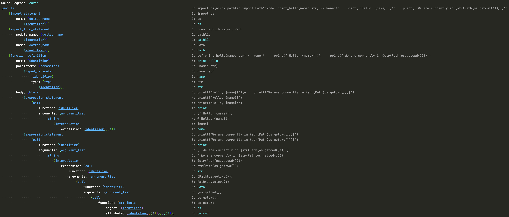
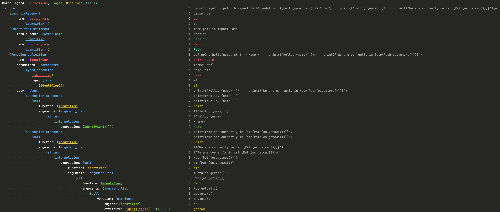

# pretty-sitter

Pretty printer for tree-sitter

## Usage

```python
from pretty_sitter import PrettySitter
from tree_sitter import Node

root: Node = ...  # obtain a `root` node from tree-sitter

PrettySitter().pprint(root)
```

You can also use some configurations from [pretty_sitter/config.py](pretty_sitter/config.py),
both during initialization of the `PrettySitter` and for a specific run of `pprint`.
Here is an example showcasing both:

```python
from pretty_sitter import PrettySitter
from pretty_sitter.config import FilterConfig, UIConfig
from tree_sitter import Node

root: Node = ...  # obtain a `root` node from tree-sitter

PrettySitter(
    FilterConfig(only_types=['identifier'])
).pprint(
    root,
    UIConfig(
        with_trivial=True,  # those whose type is equal to their actual content, e.g. '(', ':', 'pass'
        column_width=90,
    )
)
```

## Example

Here is a fully working example (taken from [tests/test_pretty_sitter.py](tests/test_pretty_sitter.py) with adaptations):

```python
import tree_sitter_python
from pretty_sitter import PrettySitter
from pretty_sitter.config import FilterConfig
from tree_sitter import Language, Parser

parser = Parser(language := Language(tree_sitter_python.language()))

code = '''
import os
from pathlib import Path

def print_hello(name: str) -> None:
    print(f'Hello, {name}!')
    print(f'We are currently in {str(Path(os.getcwd()))}')
'''.lstrip()

root = parser.parse(bytes(code, 'utf8')).root_node
pretty_sitter = PrettySitter(
    FilterConfig(only_types=['identifier'])
)
pretty_sitter.pprint(root)
```

Output:



## Teaser: Integration with tree-tagger (coming soon!)

**tree-tagger** is another useful turbo package for tree-sitter, which enables you to extract identifiers
from the code such as functions, classes and variables, separating between identifier definitions and usages.
It is coming very soon to GitHub, including support for several programming languages. Stay tuned!

Here is how the output should appear when we use tree-tagger
along with pretty-sitter's [MarkingConfig](pretty_sitter/config.py?plain=1#L34):


