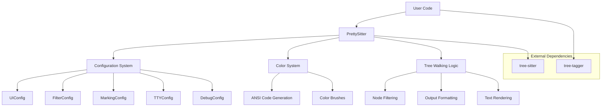
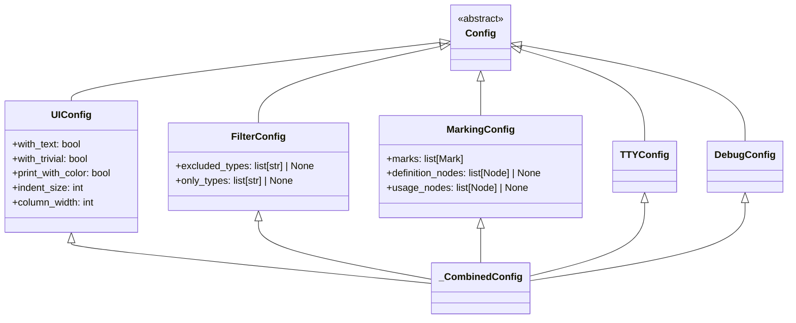
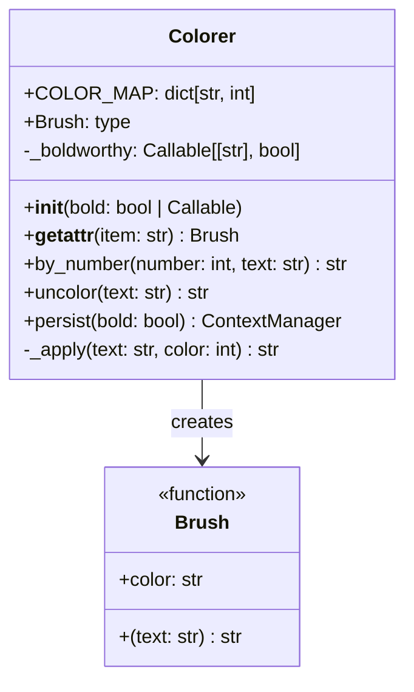
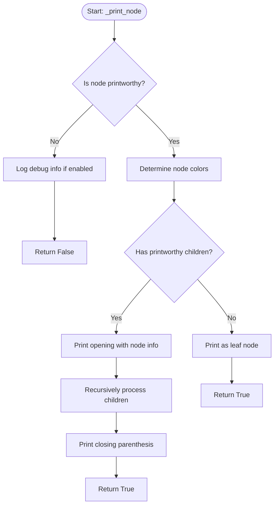
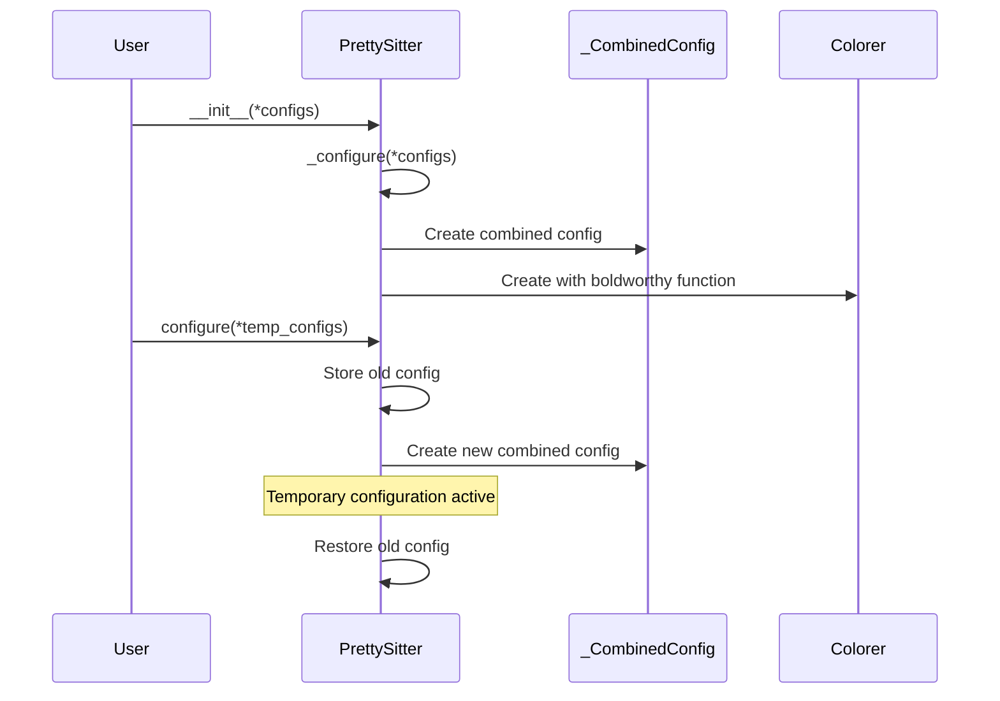
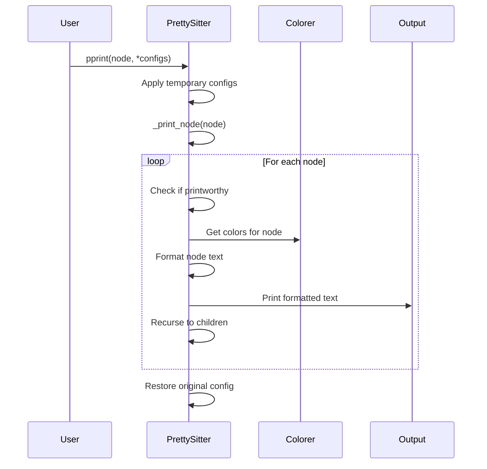

# Architecture Documentation

This document provides an in-depth look at the pretty-sitter architecture, design decisions, and system components. Understanding this architecture will help you contribute effectively and make informed decisions when extending the system.

## System Overview

pretty-sitter is designed as a modular, configurable system for pretty-printing tree-sitter parse trees. The architecture follows several key principles:

- **Separation of Concerns**: Each component has a specific responsibility
- **Composition over Inheritance**: Components are composed rather than deeply inherited
- **Configuration-Driven**: Behavior is controlled through configuration objects
- **Extensibility**: New features can be added without modifying core components

## High-Level Architecture



## Core Components

### 1. PrettySitter Class

The `PrettySitter` class serves as the main entry point and orchestrator for the entire system.

#### Responsibilities

- **Configuration Management**: Combines and manages multiple configuration objects
- **Tree Traversal**: Implements the recursive tree walking algorithm
- **Output Coordination**: Coordinates between filtering, coloring, and formatting
- **Context Management**: Provides temporary configuration overrides

#### Key Design Decisions

**Configuration Composition**: Instead of a monolithic configuration class, pretty-sitter uses multiple specialized configuration classes that are combined at runtime. This allows users to configure only the aspects they care about.

```python
# Users can mix and match configurations
ps = PrettySitter(
    UIConfig(with_text=False),
    FilterConfig(only_types=['function_definition']),
    MarkingConfig(definition_nodes=def_nodes)
)
```

**Context Manager Pattern**: The `configure()` method uses a context manager to temporarily override configuration, ensuring that changes don't persist beyond their intended scope.

```python
with ps.configure(UIConfig(print_with_color=False)):
    ps.pprint(node)  # Temporarily disable colors
# Original configuration restored
```

### 2. Configuration System

The configuration system is built around a hierarchy of specialized configuration classes.

#### Configuration Class Hierarchy



#### Design Rationale

**Dataclass-Based**: All configuration classes use Python dataclasses for automatic initialization, equality, and representation methods.

**Immutable by Design**: Configuration objects are designed to be immutable after creation, preventing accidental modification.

**Specialized Concerns**: Each configuration class handles a specific aspect of the system:
- `UIConfig`: Visual appearance and formatting
- `FilterConfig`: Node inclusion/exclusion logic
- `MarkingConfig`: Semantic highlighting and node marking
- `TTYConfig`: Terminal and pager behavior
- `DebugConfig`: Debugging and diagnostic output

**Runtime Combination**: The `_CombinedConfig` class uses multiple inheritance to create a unified configuration object at runtime, allowing the system to access all configuration options through a single interface.

### 3. Color System (Colorer)

The `Colorer` class manages ANSI color code generation and application.

#### Architecture



#### Key Features

**Dynamic Color Brushes**: Colors are accessed as attributes (`colorer.red`) or items (`colorer['red']`), returning callable "brush" functions that apply the color to text.

**Conditional Bold Formatting**: The boldworthy function allows dynamic determination of when text should be bold, enabling context-sensitive formatting.

**ANSI Code Management**: Centralizes all ANSI escape sequence generation and provides utilities for stripping color codes.

**Numeric Color Generation**: The `by_number()` method generates colors based on numeric input, useful for depth-based coloring in tree structures.

#### Design Decisions

**Functional Interface**: Color brushes are functions rather than methods, making them composable and easy to pass around.

**Stateful Bold Logic**: The boldworthy function is stored as instance state, allowing different Colorer instances to have different bold behaviors.

**Static Utility Methods**: Methods like `uncolor()` are static because they don't depend on instance state and are useful as standalone utilities.

### 4. Tree Walking Algorithm

The tree walking logic is implemented primarily in the `_print_node()` method of `PrettySitter`.

#### Algorithm Flow



#### Filtering Logic

The system uses multiple filtering criteria to determine if a node should be printed:

1. **Type Exclusion**: Nodes in `excluded_types` are skipped
2. **Type Inclusion**: If `only_types` is set, only those types (and their children) are included
3. **Trivial Node Filtering**: Nodes where type equals text content can be filtered out
4. **Composite Logic**: All filters are combined using boolean logic

```python
def _printworthy(self, n: Node) -> bool:
    return not any((
        self._excluded(n),
        not self._included(n),
        not self._config.with_trivial and not self._nontrivial(n),
    ))
```

#### Design Rationale

**Recursive Descent**: The algorithm uses recursive descent to naturally follow the tree structure, making the code intuitive and easy to understand.

**Early Termination**: Nodes are filtered as early as possible to avoid unnecessary processing of subtrees.

**Stateless Methods**: Most helper methods are stateless, taking the node as a parameter rather than storing state, making them easier to test and reason about.

## Data Flow

### Configuration Flow



### Rendering Flow



## Extension Points

The architecture provides several extension points for adding new functionality:

### 1. New Configuration Types

Add new configuration classes by inheriting from `Config`:

```python
@dataclass
class MyCustomConfig(Config):
    custom_option: bool = False
    custom_value: int = 42

# Update _CombinedConfig to include the new config
@dataclass
class _CombinedConfig(UIConfig, FilterConfig, MarkingConfig, 
                     TTYConfig, DebugConfig, MyCustomConfig):
    pass
```

### 2. Custom Color Schemes

Extend the color system by modifying `COLOR_MAP` or adding new color methods:

```python
class ExtendedColorer(Colorer):
    COLOR_MAP = {
        **Colorer.COLOR_MAP,
        'purple': 95,
        'orange': 208,
    }
    
    def rainbow(self, text: str) -> str:
        # Custom rainbow coloring logic
        pass
```

### 3. Custom Filtering Logic

Add new filtering criteria by extending the filtering methods:

```python
class ExtendedPrettySitter(PrettySitter):
    def _printworthy(self, n: Node) -> bool:
        # Add custom filtering logic
        if self._config.custom_filter_enabled:
            return self._custom_filter(n) and super()._printworthy(n)
        return super()._printworthy(n)
```

### 4. Output Formatters

The rendering logic can be extended to support different output formats:

```python
class JSONPrettySitter(PrettySitter):
    def _print_node(self, n: Node, **kwargs) -> dict:
        # Return JSON structure instead of printing
        return {
            'type': n.type,
            'text': self._text(n),
            'children': [self._print_node(child) for child in n.children]
        }
```

## Design Patterns Used

### 1. Strategy Pattern

The configuration system uses the strategy pattern to allow different behaviors:

```python
# Different strategies for bold formatting
colorer = Colorer(bold=lambda text: text.startswith('def'))
colorer = Colorer(bold=True)
colorer = Colorer(bold=False)
```

### 2. Composite Pattern

Configuration objects are composed to create complex behaviors:

```python
ps = PrettySitter(
    UIConfig(with_text=False),      # UI strategy
    FilterConfig(only_types=['def']), # Filtering strategy
    MarkingConfig(marks=marks)       # Marking strategy
)
```

### 3. Template Method Pattern

The tree walking algorithm defines the overall structure while allowing customization of specific steps:

```python
def _print_node(self, node):
    if not self._printworthy(node):  # Customizable filtering
        return False
    
    color = self._obtain_color(node)  # Customizable coloring
    text = self._format_node(node)    # Customizable formatting
    self._print(text)                 # Customizable output
```

### 4. Context Manager Pattern

Temporary configuration changes use the context manager pattern:

```python
@contextlib.contextmanager
def configure(self, *configs):
    old_config = self._config
    self._configure(*configs)
    try:
        yield
    finally:
        self._config = old_config
```

## Performance Considerations

### Memory Usage

- **Lazy Evaluation**: Colors and formatting are computed on-demand
- **No Deep Copying**: Configuration objects are combined by reference
- **Minimal State**: Most methods are stateless to reduce memory overhead

### Processing Efficiency

- **Early Filtering**: Nodes are filtered before expensive operations
- **Cached Computations**: Color brushes are created once and reused
- **Minimal String Operations**: ANSI codes are applied efficiently

### Scalability

- **Linear Complexity**: Tree walking is O(n) where n is the number of nodes
- **Configurable Output**: Users can reduce output size through filtering
- **Streaming Output**: Large trees can be processed without loading everything into memory

## Testing Architecture

### Test Organization

Tests are organized to match the component structure:

- **Unit Tests**: Test individual components in isolation
- **Integration Tests**: Test component interactions
- **End-to-End Tests**: Test complete workflows with real parse trees

### Test Patterns

**Fixture-Based Testing**: Common test data is provided through pytest fixtures:

```python
@pytest.fixture
def sample_node():
    return create_test_node()

@pytest.fixture
def pretty_sitter():
    return PrettySitter()
```

**Configuration Testing**: Each configuration class has dedicated tests:

```python
def test_ui_config_affects_output_format():
    config = UIConfig(with_text=False)
    # Test that configuration changes behavior
```

**Mock-Free Testing**: Tests use real tree-sitter parse trees rather than mocks to ensure realistic testing conditions.

## Future Architecture Considerations

### Planned Extensions

1. **Plugin System**: Allow third-party extensions through a plugin architecture
2. **Output Formats**: Support for HTML, JSON, and other output formats
3. **Streaming Processing**: Handle very large parse trees through streaming
4. **Caching Layer**: Cache formatted output for repeated operations

### Scalability Improvements

1. **Parallel Processing**: Process independent subtrees in parallel
2. **Incremental Updates**: Update only changed parts of the tree
3. **Memory Optimization**: Reduce memory usage for very large trees

### API Evolution

The architecture is designed to support API evolution while maintaining backward compatibility:

- **Configuration Versioning**: New configuration options with sensible defaults
- **Deprecation Support**: Gradual migration paths for API changes
- **Extension Points**: Well-defined interfaces for extending functionality

## Conclusion

The pretty-sitter architecture balances simplicity with extensibility, providing a clean separation of concerns while allowing for powerful customization. The modular design makes it easy to understand, test, and extend individual components without affecting the entire system.

Key architectural strengths:

- **Modular Design**: Clear separation between configuration, coloring, and rendering
- **Composable Configuration**: Mix and match configuration options as needed
- **Extensible Framework**: Well-defined extension points for new functionality
- **Performance Conscious**: Efficient algorithms and minimal overhead
- **Test-Friendly**: Architecture supports comprehensive testing at all levels

This architecture provides a solid foundation for the current feature set while remaining flexible enough to support future enhancements and extensions.